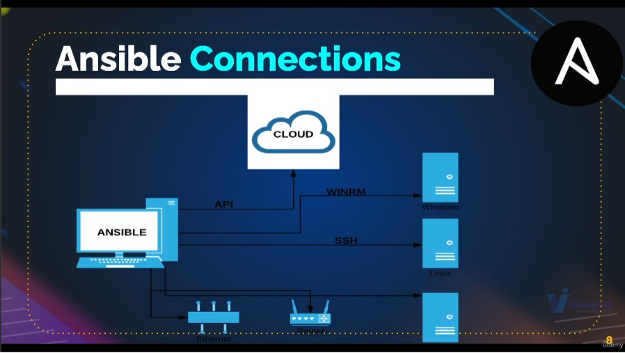
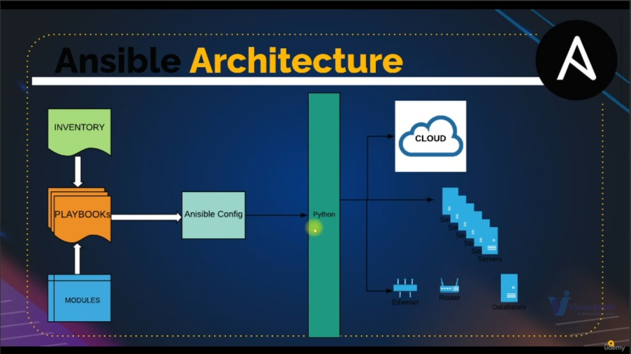
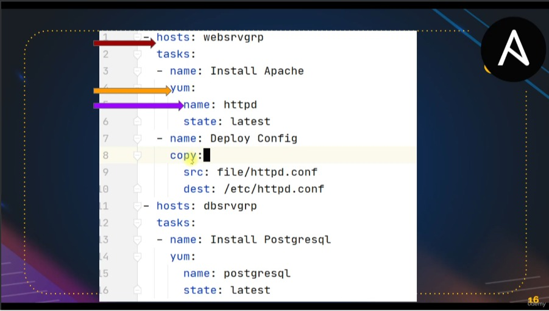
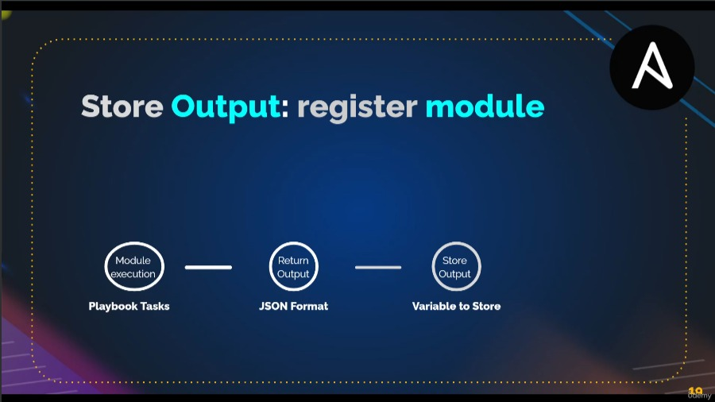
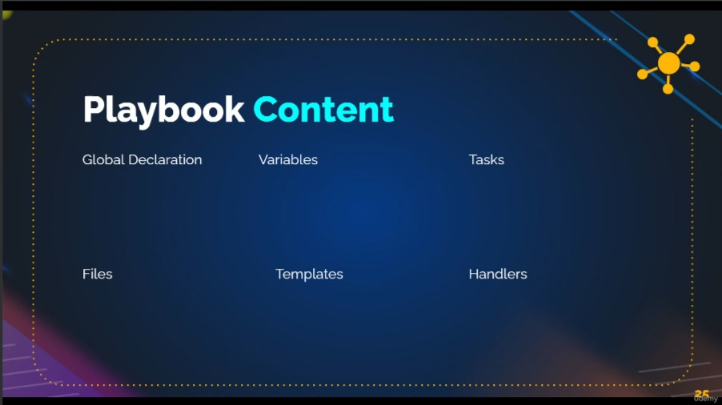
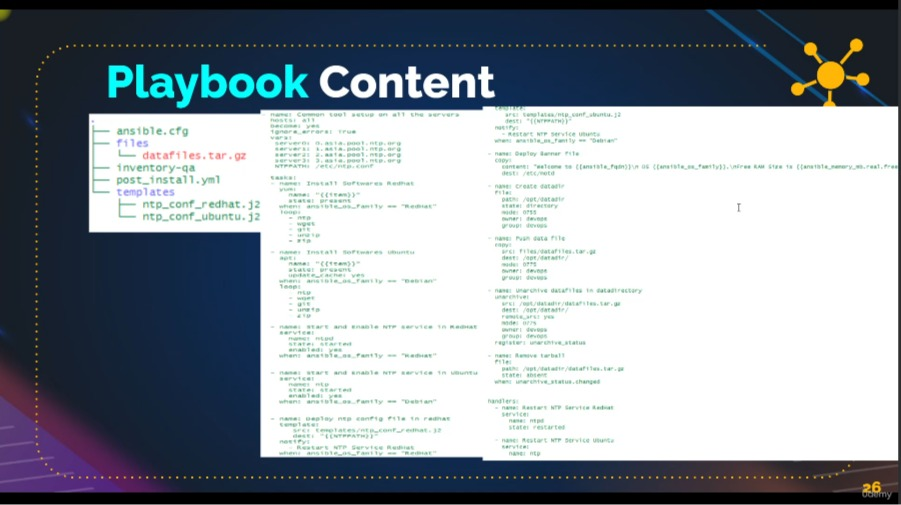
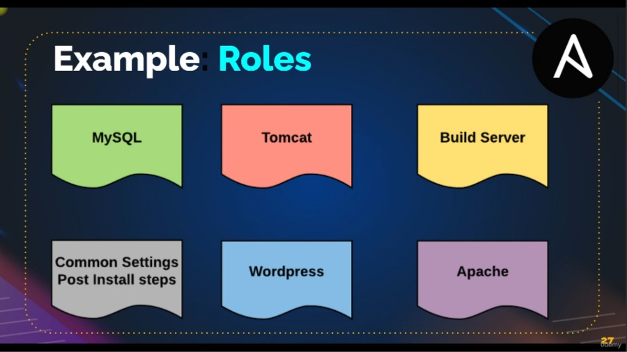
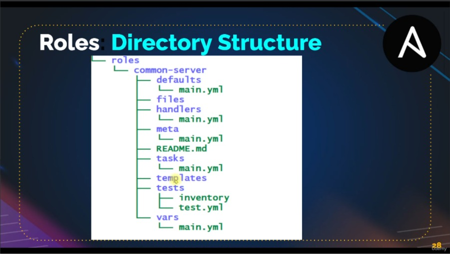

# **Ansible**

|PLAN|
|----|
|Présentation|
|Configurer Ansible et Infra|
|Module d'inventaire et de ping|
|Inventaire Partie 2|
|YAML & JSON|
|Commandes ad hoc|
|Livre de jeu et modules|
|Modules - Rechercher, utiliser, dépanner et répéter|
|Configuration Ansible|
|Variables et débogage|
|Variables de groupe et d'hôte|
|Variables factuelles|
|Prise de décision|
|Boucles|
|Modules de fichiers, de copies et de modèles|
|Handlers|
|Rôles|
|Ansible pour AWS|
|Code profil V|

## Presentation


#### **Histoire de l'automatisation**

+ **Perspective**
   + 1. Srcipts Bash pour Linux/Scripts Bash pour Windows
   + 2. Python/PERL/Ruby
   + 3. Powershell
   + 4. Puppet
   + 5. Salt Stack
   + 6. Chef
   + 7. Ansible
   + 8. Terraform

#### **Ansible**

+ **Cas d'utilisation**
   + **Automatisation** : Toute automatisation de système
   + **Gestion des modifications** : modifications du serveur de production
   + **Provisioning** : Configuration des serveurs à partir de zéro Provisionnement cloud.
   + **Orchestration** : Cadre d'automatisation à grande échelle.

+ **Ansible est simple**

   + **Aucun agent :**
     + Les machines/services cibles sont accessibles par SSH, winrm et API
   + **Aucune base de données :**
     + YAML, INI & textes
   + **Aucune configuration Complexe**
     + C'est juste une bibliothèque Python.
   + **Aucun logiciel résiduel**
     + Pousser le paquet Python
     + Exécuter
     + Sortie de retour

+ **YAML**

   + Aucune programmation
   + Structuré
   + Facile à lire et à écrire

+ **API**
   + URL/appels reposants (par exemple Cloud)
   + Commandes Shell
   + Scénarios

+ **Puissance Ansible**
   + Peut remplacer presque tous ou n'importe quel outil d'automatisation dans le travail DevOps ou Ops.

+ `Ansible` est un outil open-source de gestion de configuration, d'automatisation des tâches et de déploiement logiciel. **Il permet aux administrateurs système de gérer efficacement la configuration des serveurs, le déploiement d'applications et l'orchestration des infrastructures informatiques**. Pour comprendre la connexion et l'architecture d'Ansible, il est essentiel de se pencher sur ses principaux composants et leur fonctionnement.

+ `L'architecture d'Ansible` repose sur un modèle client-serveur où un `nœud de contrôle (control node)` communique avec `les nœuds gérés (managed nodes) via SSH (Secure Shell) pour exécuter des tâches`. Le nœud de contrôle contient `l'inventaire des nœuds gérés, les playbooks (fichiers YAML décrivant les tâches à effectuer), les rôles (ensembles de playbooks réutilisables) et les modules (unités d'exécution des tâches)`. Lorsqu'une commande ou un playbook est lancé depuis le nœud de contrôle, Ansible se connecte aux nœuds gérés pour exécuter les actions spécifiées.



+ La connexion entre le nœud de contrôle et les nœuds gérés est établie via SSH, ce qui garantit une communication sécurisée et chiffrée. Ansible ne nécessite pas l'installation d'un agent sur les nœuds gérés, ce qui simplifie sa mise en œuvre et réduit la charge administrative. De plus, Ansible utilise un modèle push plutôt que pull, ce qui signifie que les actions sont lancées depuis le nœud de contrôle vers les nœuds gérés.



+ En résumé, la connexion et l'architecture d'Ansible reposent sur un modèle client-serveur utilisant SSH pour la communication sécurisée entre le nœud de contrôle et les nœuds gérés. Cette approche simplifiée et efficace en fait un outil populaire pour l'automatisation des opérations informatiques.

## Playbooks et Modules

**Les playbooks sont écrits au format YAML**

```
- hosts: websrvgrp
tasks:
  - yum:
    name:httpd
    state:present
```




## **Ansible Configuration**

#### **Paramètres de configuration Ansible**
+ Modifier le comportement par défaut d'Ansible.

#### **Ordre de configuration Ansible**

+ 1. `ANSIBLE_CONFIG` (variable d'environnement si définie)
+ 2. `ansible.cfg` (Dans le répertoire courant)
+ 3. `~/.ansible.cfg` (Dans le répertoire personnel)
+ 4. `/etc/ansible/ansible.cfg`

## Variables & Debug

`Variables de playbook` : Ces variables sont définies dans le playbook lui-même et peuvent être utilisées dans toutes les tâches de ce playbook. Elles sont déclarées en utilisant la clé vars au niveau du playbook ou dans des sections spécifiques du playbook telles que tasks, handlers, pre_tasks, ou post_tasks.

```
- name: Playbook with playbook-level variables
  hosts: all
  vars:
    my_variable: value
  tasks:
    - name: Task using playbook-level variable
      debug:
        msg: "My variable is {{ my_variable }}"

```

`Variables basées sur l'inventaire` : Ces variables sont définies dans les fichiers d'inventaire Ansible. Elles sont déclarées en utilisant la notation `YAML` ou `INI` dans les fichiers d'inventaire pour chaque groupe d'hôtes ou pour des hôtes individuels.

```
all:
  hosts:
    host1:
    host2:
  vars:
    my_variable: value

```

`Variables basées sur les rôles` : Ces variables sont définies dans la structure d'un rôle Ansible. Elles peuvent être définies dans le dossier `defaults, vars, ou vars_files` du rôle et sont accessibles à toutes les tâches du rôle. Les variables définies dans defaults sont écrasées par celles définies dans vars.


```
my_role/
  defaults/
    main.yml
  tasks/
  handlers/
  vars/
    main.yml

```


#### **Variables factuelles : module de configuration**
+ `ansible_os_family`
   + Nom du système d'exploitation comme RedHat, Debian, etc.
+ `ansible_processor_cores`
   + Nombre de cœurs `CPU`
+ `ansible_kernel`
   + version du noyau
+ `ansible_devices`
   + Informations sur l'appareil connecté
+ `ansible_default_ipv4`
   + IP, adresse MAC, passerelle, etc.
+ `ansible_architecture`
   + 64 bits ou 32 bits

#### **Sortie de stockage : module d'enregistrement**




## Roles










